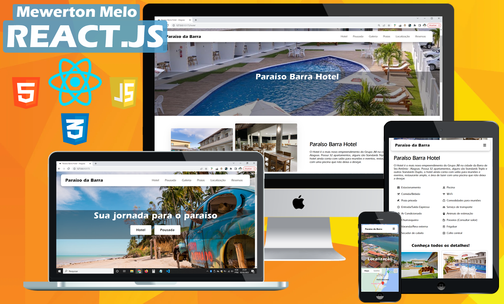

  <h1 align="center"><a href="#">Website - Paraíso Barra Hotel</a></h1>

<h4 align="center"> 
	 Status: Finalizando
</h4>

  <h4 align="center"><a href="https://paraisobarrahotel.com.br">https://paraisobarrahotel.com.br</a></h4>

  

## 💻 Sobre:

A aplicação desenvolvida é um site para um Hotel e Pousada.
Nesse caso o mesmo site foi usando para os dois empreendimentos,
ambos são do mesmo proprietário, com isso cada empreendimento tem
sua página com suas especificações. 

Neste projeto foram abordados os seguintes temas:

- [ReactJs](https://reactjs.org)
- [Javascript](https://developer.mozilla.org/pt-BR/docs/Web/JavaScript)
- [Vite](https://vitejs.dev/)
- [Styled Components](https://styled-components.com/)
- [React Router Dom](https://react-icons.github.io/react-icons/)
- [React Google Maps](https://www.npmjs.com/package/@react-google-maps/api)
- [React Icons](https://react-icons.github.io/react-icons)

---

## 🛠 Tecnologias

Este projeto será desenvolvido com as seguintes tecnologias:

- HTML
- CSS
- JavaScript
- React.js

---

## Deploy do projeto.
https://paraisobarrahotel.com.br

---

